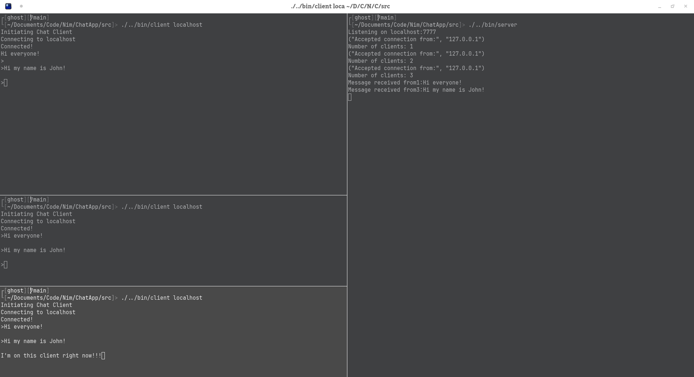

<!-- PROJECT LOGO -->
<br />
<div align="center">
  <a href="https://github.com/Ollicron/ChatApp">
    
  </a>
</div>

# Chat Application

This is a guided project I was working on that was inspired by Dominik Picheta's Nim in Action book. 

I rewrote the entire thing to be fully asynchronous with connected clients. I made sure to avoid race conditions by using a lock to prevent the server's client socket list from being accessed while some other asynchronous task is trying to access it.

## Compilation

### Prerequisites

Currently this is only working for Linux and Mac OSX due to to the nature of using `/dev/stdin` and `/dev/stdout` to access the I/O streams. With Windows you unfortunately cannot do this easily through asynchronous procedures.

### Installation
To compile the program you will need an installation of Nim. Navigate to the main directory and run the following:

```
# Compile the server script
nim c -o:./bin/server ./src/server.nim

# Compile the client script
nim c -o:./bin/client ./src/client.nim
```

Then run the server with:
```
./bin/server
```
Then run as many instances of the client with:
```
./bin/client localhost
```